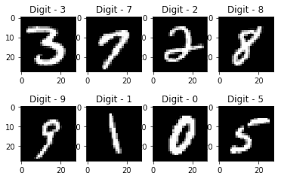

# ml_projects
Experimental projects in Machine Learning.

Handwritten Digit Recognition
Handwritten Digit Recognition là một ứng dụng sử dụng học máy và học sâu để nhận diện các chữ số viết tay từ bộ dữ liệu MNIST. Mô hình được xây dựng để nhận diện chữ số từ các hình ảnh số học viết tay và có thể ứng dụng trong nhiều lĩnh vực như nhận dạng chữ viết tay trong các hệ thống tự động, kiểm tra bài thi, hay nhận diện các mã vạch từ các tài liệu giấy.

Các bước thực hiện
Thu thập dữ liệu:

Bộ dữ liệu MNIST bao gồm 60,000 hình ảnh huấn luyện và 10,000 hình ảnh kiểm tra, mỗi hình ảnh là một số viết tay có kích thước 28x28 pixel.
Tiền xử lý dữ liệu:

Dữ liệu được chuẩn hóa về phạm vi [0, 1] bằng cách chia mỗi pixel cho 255.
Các nhãn của dữ liệu được chuyển đổi thành dạng one-hot encoding.
Xây dựng mô hình:

Mô hình học sâu sử dụng mạng nơ-ron (Neural Network) với các lớp Dense và lớp Flatten để chuyển đổi hình ảnh 2D thành dạng 1D.
Hàm kích hoạt ReLU được sử dụng cho các lớp ẩn, trong khi đó, hàm Softmax được dùng ở lớp đầu ra để phân loại 10 chữ số từ 0 đến 9.
Huấn luyện mô hình:

Mô hình được huấn luyện với bộ dữ liệu MNIST, sử dụng thuật toán tối ưu Adam và hàm mất mát categorical cross-entropy.
Sau khi huấn luyện xong, mô hình sẽ được đánh giá trên bộ dữ liệu kiểm tra (test data).
Ứng dụng nhận diện chữ số viết tay:

Sau khi huấn luyện, mô hình có thể được sử dụng để nhận diện chữ số viết tay từ người dùng qua giao diện vẽ.
Giao diện vẽ sử dụng thư viện Tkinter, cho phép người dùng vẽ các chữ số và mô hình sẽ đưa ra dự đoán.
Các tính năng chính
Dự đoán chữ số: Nhận diện các chữ số viết tay từ 0 đến 9.
Xây dựng mô hình học sâu: Sử dụng các lớp Dense và ReLU cho việc nhận dạng chính xác.
Giao diện người dùng: Người dùng có thể vẽ chữ số trực tiếp và mô hình sẽ đưa ra kết quả dự đoán.
Xử lý ảnh: Hình ảnh viết tay sẽ được tiền xử lý trước khi đưa vào mô hình để dự đoán.
Cài đặt và sử dụng
Cài đặt môi trường
Để chạy ứng dụng này, bạn cần cài đặt các thư viện sau:

bash
Sao chép mã
pip install tensorflow numpy matplotlib pillow opencv-python tk
Chạy ứng dụng
Huấn luyện mô hình: Chạy script handwritten_digit_recognition.py để huấn luyện mô hình với bộ dữ liệu MNIST.
bash
Sao chép mã
python handwritten_digit_recognition.py
Dự đoán chữ số: Sau khi huấn luyện, bạn có thể sử dụng giao diện vẽ để nhận diện chữ số viết tay.
bash
Sao chép mã
python drawing_app.py
Giao diện người dùng: Một cửa sổ GUI sẽ mở ra, nơi bạn có thể vẽ chữ số. Sau khi vẽ xong, nhấn "Predict" để mô hình đưa ra dự đoán.